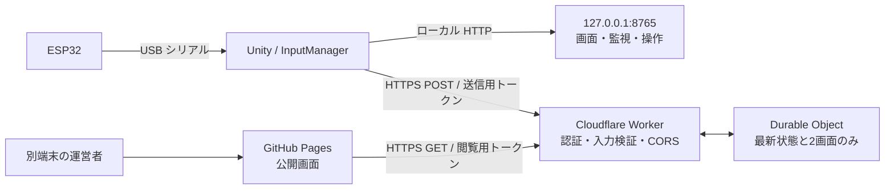

# 別端末・外出先からのレース監視：実装計画

## 到達点と現状

到達点は、Unity の PC と異なる端末から GitHub Pages の画面を開き、ゲーム状態、P1/P2 のカメラ画像、シリアル診断を閲覧できること。遠隔版は**閲覧専用**にする。開始・結果表示・再挑戦・タイトル復帰は `127.0.0.1:8765` のローカル画面だけで行う。

**この文書は実装計画であり、中継サービス・遠隔送信・閲覧認証はまだ実装していない。** 現在の公開ページは同じ PC のループバック API にしか接続できない。GitHub Pages はサーバー側プログラムを実行できないため、別端末向けには中継サービスが必要になる。これは [GitHub Pages の公式説明](https://docs.github.com/en/pages/getting-started-with-github-pages/creating-a-github-pages-site) と現行コードから導かれる構成上の結論。

## 構成



Unity から外向きの HTTPS のみを使用する。ゲーム PC へのインターネット側ポート開放は行わない。Worker は認証と入力検証を担当し、固定名の Durable Object 1 個を最新状態の共有先にする。Durable Object は同じ ID 宛ての要求を 1 つのアクティブなインスタンスに集められる。[Cloudflare の名前付き Object](https://developers.cloudflare.com/durable-objects/api/namespace/) と [メモリ上の状態](https://developers.cloudflare.com/durable-objects/reference/in-memory-state/) に沿う。

最新状態と画像はメモリにだけ保持し、履歴を残さない。Object の再起動・退避でメモリは失われるため、その間は「再接続中」と表示し、次の Unity 送信で復旧する。[Cloudflare のライフサイクル仕様](https://developers.cloudflare.com/durable-objects/concepts/durable-object-lifecycle/) により、メモリを永続保存とみなさない。

## API 契約（案）

| メソッド・パス | 呼び出し元 | 内容 |
| --- | --- | --- |
| `POST /v1/ingest/session` | Unity | 送信用トークンを検証し、サーバー発行のセッション ID を返す。前のセッションの状態と画像を破棄する。 |
| `POST /v1/ingest/status` | Unity | 状態 JSON。セッション ID、単調増加する連番、P1/P2、シリアルの新規ログを含む。上限 32 KiB。 |
| `POST /v1/ingest/frame/1` と `/2` | Unity | JPEG 1 枚。セッション ID・各プレイヤーの連番をヘッダーに付ける。上限 150 KiB。 |
| `GET /v1/view/status` | 公開画面 | 最新状態、サーバー受信時刻、オンライン／古い状態を返す。 |
| `GET /v1/view/frame/1` と `/2` | 公開画面 | 最新 JPEG。画像がない・古い場合は `204` を返す。 |

全 API を HTTPS にし、`Cache-Control: no-store` を付ける。Worker は `Content-Type`、サイズ、スキーマ版、状態の列挙値、数値範囲、JPEG の先頭・末尾、プレイヤー番号を検証する。予期しないフィールドをそのまま画面へ表示しない。Unity の時計ではなく、Worker が受信した時刻で鮮度を判定する。新セッションで旧画像を消し、古い連番や旧セッションからの遅延送信は拒否する。

状態送信の最小形は次の通り。`serialDelta` は最後に確認できた行の後から最大 20 行とし、`latestSerialId` により欠落を検知する。ネットワーク断で 20 行を超えて欠けた場合は、ログを完全な履歴と偽らず「N 行を取得できませんでした」と表示する。Durable Object は受信した行を最大 80 件だけ保持する。

```json
{
  "schemaVersion": 1,
  "sessionId": "server-issued-id",
  "seq": 42,
  "state": "Game",
  "raceTimeSeconds": 83.2,
  "goalLap": 3,
  "players": [
    {"number": 1, "connected": true, "lap": 2, "speedKmh": 54.1, "pedal": 0.8, "steering": -0.1},
    {"number": 2, "connected": true, "lap": 1, "speedKmh": 49.3, "pedal": 0.7, "steering": 0.2}
  ],
  "serial": {"portOpen": true, "received": 2500, "errors": 4, "latestSerialId": 2500,
    "serialDelta": [{"id": 2500, "time": "12:00:00.000", "status": "OK", "line": "0.8,-1.5,0.7,3.0"}]}
}
```

Unity はメインスレッドで状態と画像を取得し、`UnityWebRequest` で非同期送信する。通信中に次の周期が来た場合は同種類の古い送信を捨て、キューを伸ばさない。タイムアウト・指数バックオフ・再接続時のセッション再取得を入れる。Unity 6 の [UnityWebRequest](https://docs.unity3d.com/6000.0/ScriptReference/Networking.UnityWebRequest.html) と [UploadHandlerRaw](https://docs.unity3d.com/6000.0/ScriptReference/Networking.UploadHandlerRaw.html) が HTTPS とバイナリ送信に対応することを確認済み。

## 認証と公開画面

- Worker の `INGEST_TOKEN` と `VIEW_TOKEN` は別々の十分長いランダム値にする。Worker では [Secrets](https://developers.cloudflare.com/workers/configuration/secrets/) として設定する。Git、GitHub Pages の JavaScript、ワークフロー、ログには含めない。
- Unity 側の送信用トークンは PC ごとの非公開設定から読み込む。ソースや Unity アセットとしてコミットしない。
- 公開ページは閲覧用トークンを運営者に入力してもらい、画面を閉じるまでメモリにだけ置く。URL、`localStorage`、画像 URL、コンソールには載せない。閲覧の GET も `Authorization: Bearer` を必須とする。`fetch` で画像を取得し、Blob URL にして表示する。
- Worker の CORS は `https://tk75attractions.github.io` のみを許可し、`Authorization` のプリフライトに対応する。**CORS は認証の代わりではない**ため、送信・閲覧ともトークンを必ず検証する。
- 公開ページの遠隔モードでは操作ボタンを表示しないか無効化する。Worker にゲーム操作エンドポイントを作らない。ローカルの操作 API は引き続きループバック専用とする。
- 送信用・閲覧用トークンは個別にローテーションできるようにする。少人数での共通閲覧トークンを初期案とし、利用者ごとの権限・失効が必要になったらログイン方式を別途設計する。

## 更新周期と負荷の仮設定

- 状態：Unity から 2 秒ごとに送信、公開画面は 2 秒ごとに取得。最終受信から 6 秒を超えたら「オフライン」。
- 画像：P1/P2 を各 5 秒ごとに 480×270 JPEG で送信、公開画面も各 5 秒ごとに取得。最終受信から 12 秒を超えた画像は表示しない。ローカル画面の 640×360 / 約2秒とは独立させる。
- 1 人が 8 時間連続閲覧する場合、概算は (状態送信 0.5 + 画像送信 0.4 + 状態取得 0.5 + 画像取得 0.4) × 28,800 秒 = **51,840 リクエスト**。24 時間では **155,520 リクエスト**で、Cloudflare Workers Free の現行 100,000 リクエスト/日の枠を超える。全要求を Durable Object に転送する設計なので、Durable Object 側にも同程度の要求数が発生する。複数閲覧者・CORS プリフライト・再試行でも増えるため、本番前にプランと利用時間を決める。[Workers の制限](https://developers.cloudflare.com/workers/platform/limits/)と [Durable Objects の料金・無料枠](https://developers.cloudflare.com/durable-objects/platform/pricing/)を参照。画像の実際のバイト数と転送量も現地映像で測る。

## 実装順序と判定条件

1. **Worker / Durable Object の雛形**：認証、CORS、固定名 Object、表にある 5 種類の読み書き API をローカルで作る。新規 Object は SQLite バックエンドとして登録する。無料プランでは SQLite バックエンドのみ利用でき、現在の Wrangler では [Durable Object class exports](https://developers.cloudflare.com/durable-objects/reference/durable-objects-migrations/) で宣言する。未認証は `401`、不正データは `400` または `413`、未受信はオフラインを返す。
2. **契約テスト**：新旧セッション、逆順連番、サイズ超過、画像の誤形式、6 秒/12 秒の期限切れ、Object 再起動で旧画像が残らないことを確認する。エラー応答にも必要な CORS ヘッダーを付け、公開画面に理由を表示できるようにする。
3. **Unity 送信**：送信用トークンを非公開設定から読み、状態・2画面を HTTPS で送る。Unity のフレームレート、通信断時のキュー長、送信再開を測る。中継サービスが落ちてもレース進行とローカル画面が止まらないことを確認する。
4. **公開画面の遠隔モード**：閲覧用トークン入力、接続中／オフライン／認証失敗の区別、状態と画像の取得、遠隔操作ボタンの無効化を実装する。ローカル画面の API 呼び出しは維持する。
5. **本番設定**：Cloudflare の Worker と Durable Object をデプロイし、Secrets を設定する。Worker の URL だけを公開画面に設定する。GitHub Pages の現行ワークフローで画面を更新する。
6. **別端末での受け入れ試験**：Unity PC とは別ネットワークの端末からログインして状態・P1/P2 映像・シリアルを確認する。無効トークン、Unity 停止、ネットワーク断、再接続、複数閲覧者、長時間運用を試し、API 回数と画像転送量を測る。これを通過するまで遠隔監視の完成とは扱わない。

## 確認済みの前提と未確認事項

- **確認済み**：GitHub Pages は静的配信のみ。Unity 6 は `UnityWebRequest` による HTTPS・バイナリ送信が可能。Durable Object のメモリは退避・再起動で消える。Cloudflare Worker Secrets が利用できる。上記の一次資料と照合した。
- **未確認**：Cloudflare アカウント／料金プラン、運用時間、同時閲覧者数、現地の画像サイズ、ネットワーク品質。これらは実装・実測時に確定する。設計だけで動作を保証しない。
