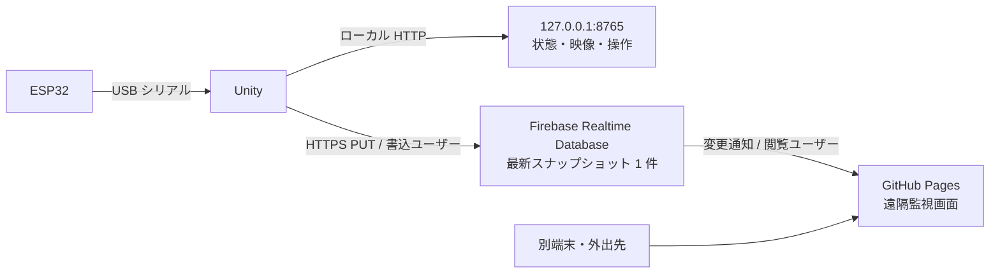

# 別端末・外出先からのレース監視：無料構成の実装計画

## 結論と現状

**Firebase Realtime Database の Spark（無料）プランを採用する。** Unity が最新状態を 5 秒ごとに 1 箇所へ上書きし、GitHub Pages の画面が Firebase の変更通知で受け取る。遠隔版はゲーム状態、2 人の入力・ラップ・速度、シリアルポートの状態と直近 10 行を表示する。**遠隔映像と遠隔操作は対象外**。開始・結果表示・再挑戦・タイトル復帰と 2 画面の映像は、従来どおり `http://127.0.0.1:8765/` のローカル画面で扱う。

Unity 送信処理、公開ページの受信処理、Security Rules はリポジトリに実装済み。**Firebase プロジェクトは未作成で、実サービス接続は未検証**。接続には [Firebase の設定手順](FirebaseSetup.md)を実施する必要がある。設定値が空の公開ページは「設定待ち」を表示する。



ゲーム PC は外向き HTTPS のみを使い、ポート開放は不要。Firebase の [Realtime Database REST API](https://firebase.google.com/docs/database/rest/save-data) は Unity からの上書き送信に使える。ブラウザは [Web SDK の `onValue`](https://firebase.google.com/docs/database/web/read-and-write) で最初の値と変更を受け取れるので、独自の Worker や Durable Object を運用しなくてよい。

## なぜこの構成か

| 候補 | 無料枠と手間 | この用途での判断 |
| --- | --- | --- |
| Firebase Realtime Database | Spark は保存 1 GB、ダウンロード 10 GB/月、同時接続 100。認証と変更通知を利用できる。 | **採用**。最新 1 件だけなら保存量は小さく、イベント中だけの少人数閲覧に向く。 |
| Supabase | Free は DB 500 MB、転送 5 GB、API 要求数に固定上限なし。低利用が続くとプロジェクトが一時停止する。 | レース間隔が長い運用では、当日の手動再開が必要になる可能性があるため今回は見送る。 |
| Cloudflare Worker + Durable Object | 前案では API、認証、状態保管を自作する必要がある。 | 小規模な閲覧専用監視には実装点が多いため採用しない。 |

無料枠は [Firebase 料金表](https://firebase.google.com/pricing)、[Spark の扱い](https://firebase.google.com/docs/projects/billing/firebase-pricing-plans)、[Supabase Free の料金表](https://supabase.com/pricing)、[一時停止の仕様](https://supabase.com/docs/guides/platform/free-project-pausing) で確認した（2026-10-03）。無料枠や利用条件は変更され得るため、利用開始時にも再確認する。Spark は上限超過時に従量課金へ自動移行するプランではないが、制限により配信できなくなる可能性がある。[Firebase の課金説明](https://firebase.google.com/docs/database/usage/billing)を参照。

**Firebase Unity SDK は使わない。** 公式の [Unity セットアップ文書](https://firebase.google.com/docs/unity/setup)ではデスクトップ対応が開発用ベータとされている。このゲームは Windows/macOS/Linux の実行を想定するため、Unity 標準の `UnityWebRequest` と Firebase の HTTPS REST API を使う。ブラウザ側だけ公式 Web SDK を使う。

## 保存するデータと通信

データベースには `/live` の 1 件だけを保持し、履歴を増やさない。Unity が前回の送信完了後に次のスナップショットを作り、`PUT /live.json?auth=<Firebase ID token>&print=silent` で丸ごと置き換える。Firebase の ID token を使う REST 呼び出しでは公式仕様上 [`auth` クエリ引数](https://firebase.google.com/docs/database/rest/auth)が必要。HTTPS を必須とし、トークンを Unity のログ、例外文、解析基盤へ出さない。リクエスト URL をログに残すネットワーク機器の有無も運用前に確認する。

```json
{
  "schemaVersion": 1,
  "sessionId": "Unity起動時に生成したUUID",
  "seq": 42,
  "updatedAt": {".sv": "timestamp"},
  "state": "Game",
  "raceTime": 83.2,
  "countdown": 0,
  "goalLap": 3,
  "inputMode": "Serial",
  "players": [
    {"number": 1, "connected": true, "lap": 2, "speed": 54.1, "pedal": 0.8, "steering": -0.1},
    {"number": 2, "connected": true, "lap": 1, "speed": 49.3, "pedal": 0.7, "steering": 0.2}
  ],
  "serial": {
    "portOpen": true,
    "port": "COM3",
    "received": 2500,
    "processed": 2496,
    "errors": 4,
    "lastResult": "OK",
    "latestSerialId": 2500,
    "lines": [{"id": 2500, "time": "12:00:00.000", "status": "OK", "line": "0.8,-1.5,0.7,3.0"}]
  }
}
```

`updatedAt` は Firebase が置き換える [サーバー時刻](https://firebase.google.com/docs/database/rest/save-data)で、閲覧端末の表示では 15 秒を超えたら「更新停止」、30 秒を超えたら「オフライン」とする。時計の大幅なずれが疑われる場合は更新時刻をそのまま表示し、接続中と断言しない。Unity は 1 件ずつ送信し、送信中に次の周期が来たら古い候補を捨てる。通信断時は指数バックオフで再試行し、ゲーム進行とローカル画面は止めない。`sessionId` と `seq` は画面側の再起動・逆順検知に用いる。**同一 Firebase プロジェクトへの同時書込 Unity は 1 プロセス**を運用条件とする。

シリアル行は最新 10 件・各行最大 120 文字に制限する。送信 JSON は 3 KiB を目標、4 KiB を上限として送信前に測る。上限を超えた場合は古い行から削り、状態や接続診断は残す。`latestSerialId` の飛びを画面で検知し、欠けた行を全履歴のように見せない。Firebase 側は旧データを上書きするため、レース履歴の保存先にはならない。

## 認証とアクセス制御

1. Firebase Authentication のメール／パスワードで、**Unity 専用の書込ユーザー**と、運営者ごとの**閲覧ユーザー**を作る。閲覧者 UID はデータベースの `roles/viewers` に登録する。ユーザーを追加しただけで自動的に閲覧権限を与えない。
2. Realtime Database Security Rules は既定で全体を拒否し、`/live` の `.write` を書込 UID だけ、`.read` を許可リスト内 UID だけに与える。`/live` の `.validate` で必須項目、型、長さ、数値範囲を検証し、未知の項目を拒否する。`null` による削除は `.validate` の対象外なので `.write` で `newData.exists()` を要求する。[Rules の仕様](https://firebase.google.com/docs/database/security)に従い、Emulator で許可・拒否をテストしてから本番に適用する。
3. Unity は書込ユーザーで [Auth REST API](https://firebase.google.com/docs/reference/rest/auth)へログインし、期限が来る前に ID token を更新する。メール／パスワードや refresh token は Git、Unity アセット、公開ページに入れない。ゲーム PC のローカル設定ファイルを OS ユーザー限定権限で保存する。**サービスアカウント鍵は Unity ビルドへ入れない。**
4. GitHub Pages は閲覧ユーザーでサインインし、Web SDK が ID token を管理する。Web 設定の API key と database URL は公開可能な識別情報だが、認証の代わりではない。書込権限は Rules だけで制限する。サイトでは明示的なサインアウトを用意し、端末の共有状況に応じてブラウザの認証保持方法を選ぶ。
5. 公開ページではゲーム操作ボタンを非表示にする。Firebase には操作用データを置かず、遠隔操作経路を作らない。ローカル画面の操作 API は従来どおりループバックのみ。

## 無料枠の概算と画像の扱い

4 KiB のスナップショットを 5 秒ごとに受け取る閲覧者 1 人が 24 時間・30 日接続すると、本文だけで約 **2.1 GB/月**。8 時間/日なら約 **0.69 GB/月**。接続処理、プロトコル、再接続、初回読込なども転送量に含まれるため、10 GB/月を人数に単純配分して保証はできない。Firebase コンソールで実測し、5 GB/月を超えたら送信周期やログ件数を見直す。保存は 1 件の上書きなので、1 GB の保存枠には十分な余裕がある想定。ただし他のデータが同じプロジェクトにある場合は合算される。

映像は扱わない。仮に 40 KiB JPEG を 2 画面・10 秒ごとに配信すると、閲覧者 1 人が 8 時間/日・30 日見るだけで本文約 **6.9 GB/月**。データベース内の画像表現や通信オーバーヘッドはさらに増える。[Cloud Storage for Firebase は現在 Blaze プランが必要](https://firebase.google.com/docs/storage/faq-and-troubleshooting)なので、画像を無料前提の初期構成へ加えない。ローカルの映像表示は維持する。

## 接続と確認項目

1. [接続手順](FirebaseSetup.md)に沿って Spark プロジェクト、Realtime Database、メール／パスワード認証、書込・閲覧アカウントを作成する。
2. [Security Rules](../Firebase/database.rules.json)と `roles` データを設定し、Emulator または Rules Playground で書込／閲覧／未許可／匿名／削除／不正型を確認する。
3. 公開設定をサイトと Unity に、書込資格情報をゲーム PC だけに登録する。別ネットワークのスマートフォンから閲覧し、Unity 停止・回線断・再接続・閲覧者失効・スナップショット肥大化を試す。
4. イベント中の転送量を実測し、無料枠に近づく場合は送信周期や行数を調整する。

## 前提と未確認事項

- 公式資料で、Spark の枠、RTDB の REST 上書き・サーバー時刻、Web SDK の変更通知、Auth と Rules の役割、Unity SDK のデスクトップ制約を確認した。**Firebase プロジェクトがまだないため、実サービスでの疎通と料金計測は未検証。**
- Firebase プロジェクトの所有者、実際の閲覧人数・時間、ネットワーク環境、シリアル行の実サイズは未確認。実装後の受け入れ試験を通るまで、遠隔監視を完成とは扱わない。
